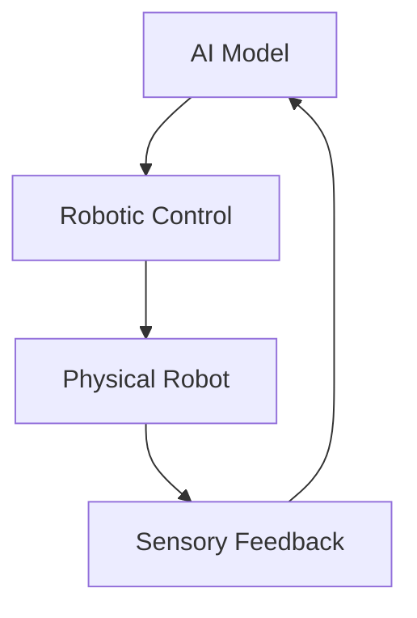

# Quickstart Guide: Physical AI & Humanoid Robotics Book Platform

## Prerequisites

- Node.js (version 18 or higher)
- npm or yarn package manager
- Git for version control
- A modern web browser

## Setup Instructions

### 1. Clone the Repository
```bash
git clone https://github.com/your-org/physical-ai-robotics-book.git
cd physical-ai-robotics-book
```

### 2. Install Dependencies
```bash
cd website
npm install
```

### 3. Initialize Docusaurus
```bash
npm run start
```

This will start the development server and open the documentation site in your browser at `http://localhost:3000`.

## Project Structure Overview

```
website/
├── docs/                 # Educational content
│   ├── chapter-1/        # First chapter content
│   │   ├── intro.md      # Chapter introduction
│   │   ├── lesson-1-physical-ai.md   # Lesson 1 content
│   │   ├── lesson-2-ros2.md          # Lesson 2 content
│   │   └── lesson-3-digital-twins.md # Lesson 3 content
│   └── index.md          # Main documentation index
├── src/
│   ├── pages/            # Custom pages
│   │   └── index.tsx     # Homepage
│   └── components/       # Reusable components
├── static/               # Static assets (images, etc.)
├── sidebars.ts           # Navigation configuration
└── docusaurus.config.ts  # Docusaurus configuration
```

## Configuration

### Enable Features
The following features are configured in `docusaurus.config.ts`:

- **MDX Support**: Enable interactive content in Markdown files
- **Mermaid Diagrams**: Add architecture diagrams and flowcharts
- **Dark/Light Mode**: Toggle between color schemes
- **Search**: Built-in search functionality
- **Versioning**: Support for multiple versions of documentation

### Navigation Setup
The sidebar navigation is configured in `sidebars.ts` with the following structure:
- Chapter 1: Foundations of Physical AI & Embodied Intelligence
  - Introduction
  - Lesson 1: From Digital AI to Physical Intelligence
  - Lesson 2: The Robotic Nervous System (ROS 2)
  - Lesson 3: Digital Twins: Simulating Reality

## Adding New Content

### Creating a New Lesson
1. Create a new Markdown file in the appropriate chapter directory
2. Add the lesson to the `sidebars.ts` configuration
3. Follow the standard lesson template with sections:
   - Conceptual Overview
   - Architecture Diagram
   - Toolchain Overview
   - Hands-on Lab
   - Code Examples
   - Expected Results
   - Common Errors & Debugging
   - Industry Notes
   - Mini Challenge
   - Summary

### Adding Diagrams
Use Mermaid syntax for architecture diagrams:



### Adding Code Examples
Use syntax highlighting for code blocks:

```python
import rclpy
from rclpy.node import Node

class PhysicalAINode(Node):
    def __init__(self):
        super().__init__('physical_ai_node')
        self.get_logger().info('Physical AI Node Started')
```

## Development Commands

```bash
# Start development server
npm run start

# Build for production
npm run build

# Serve built site locally
npm run serve

# Deploy to GitHub Pages
npm run deploy

# Clear build cache
npm run clear
```

## Customization

### Theme Colors
Custom colors for the futuristic/robotics theme are defined in `src/css/custom.css`:
- Primary: #2563eb (blue for interactive elements)
- Secondary: #0d9488 (teal for highlights)
- Dark: #1e293b (dark background)
- Light: #f8fafc (light background)

### Homepage
The custom homepage at `src/pages/index.tsx` includes:
- Hero section with course overview
- Course roadmap visualization
- Hardware requirements
- Capstone project preview

## Testing

### Content Validation
- Verify all links are functional
- Check code examples run as expected
- Ensure diagrams render correctly
- Validate accessibility standards

### Browser Compatibility
Test the site in modern browsers:
- Chrome, Firefox, Safari, Edge
- Mobile and desktop views
- Dark/light mode functionality