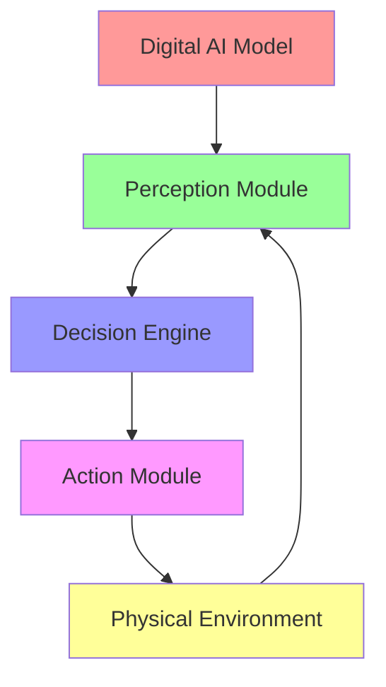

# Lesson 1: From Digital AI to Physical Intelligence

## Conceptual Overview

Physical AI represents a paradigm shift from traditional digital artificial intelligence to embodied intelligence systems that interact with and operate within the physical world. While digital AI processes information in abstract computational spaces, Physical AI must navigate the complexities of real-world physics, sensorimotor contingencies, and environmental constraints.

Traditional AI systems operate in information-rich but physics-free environments. They process text, images, or structured data without needing to account for the physical laws that govern our universe. In contrast, Physical AI systems must integrate perception, decision-making, and action in a continuous loop with the physical environment.

### Key Distinctions

**Digital AI:**
- Operates on static or batch data
- No temporal constraints (can take time to process)
- No physical embodiment or environmental interaction
- Purely information processing

**Physical AI:**
- Operates on continuous sensor streams
- Real-time constraints (must respond within physical time)
- Embodied in physical form with environmental interaction
- Perceives, decides, and acts in a closed loop

## Architecture Diagram



The diagram illustrates the closed-loop nature of Physical AI systems, where environmental feedback continuously influences decision-making processes.

## Toolchain Overview

For Physical AI development, you'll work with a specialized toolchain that includes:

- **ROS 2 (Robot Operating System 2)**: Communication framework for robotic applications
- **Gazebo/Unity**: Physics simulation environments for testing
- **Python**: Primary programming language for AI and robotics
- **Docker**: Containerization for consistent development environments
- **NVIDIA Isaac ROS**: Hardware-accelerated robotics libraries

## Hands-on Lab: Physical Intelligence Simulation

In this lab, you'll create a simple simulation that demonstrates the difference between digital processing and physical interaction.

### Setup Requirements

- Python 3.8+
- ROS 2 Humble Hawksbill
- Docker
- GPU with CUDA support (optional, for accelerated simulation)

### Lab Exercise

1. **Initialize a simple robot environment:**

```bash
# Create a workspace for our physical AI experiment
mkdir -p ~/physical_ai_ws/src
cd ~/physical_ai_ws
```

2. **Create a basic perception-action loop:**

```python
#!/usr/bin/env python3
"""
Simple Physical AI Agent demonstrating the perception-action loop
"""
import time
import random
from dataclasses import dataclass

@dataclass
class SensorReading:
    proximity: float  # Distance to nearest obstacle (0-100)
    temperature: float  # Environmental temperature
    light: float  # Ambient light level (0-100)

class PhysicalAIAgent:
    def __init__(self):
        self.position = 0
        self.energy = 100
        self.sensors = ["proximity", "temperature", "light"]

    def perceive(self) -> SensorReading:
        """Simulate sensor readings based on current environment"""
        return SensorReading(
            proximity=random.uniform(10, 90),
            temperature=random.uniform(15, 35),
            light=random.uniform(20, 80)
        )

    def decide_action(self, sensors: SensorReading):
        """Make decision based on sensor data"""
        if sensors.proximity < 30:  # Obstacle detected
            return "move_away"
        elif sensors.light > 70:  # Bright area
            return "approach_light"
        else:
            return "explore"

    def act(self, action: str):
        """Execute action in physical environment"""
        if action == "move_away":
            self.position -= 1
            self.energy -= 5
        elif action == "approach_light":
            self.position += 2
            self.energy -= 3
        elif action == "explore":
            self.position += random.choice([-1, 1])
            self.energy -= 2

    def run_cycle(self):
        """Execute one perception-action cycle"""
        sensors = self.perceive()
        action = self.decide_action(sensors)
        self.act(action)

        print(f"Position: {self.position}, Energy: {self.energy:.1f}, Action: {action}")
        return sensors, action

# Run the physical AI agent for 10 cycles
agent = PhysicalAIAgent()
for i in range(10):
    print(f"Cycle {i+1}:")
    agent.run_cycle()
    time.sleep(0.5)  # Simulate real-time constraints
```

3. **Run the simulation and observe the behavior:**

Execute the script and observe how the agent's behavior changes based on its environmental perceptions. Notice how the agent must continuously adapt to changing conditions, unlike a digital AI that processes static data.

## Expected Simulation Results

When you run the Physical AI agent simulation, you should observe:

- The agent's position changes based on environmental conditions
- Energy levels decrease as the agent takes actions
- The agent demonstrates adaptive behavior to avoid obstacles and seek favorable conditions
- Real-time constraints simulated by the sleep interval

This demonstrates the fundamental difference between digital AI (processing static inputs) and Physical AI (reacting to dynamic environments).

## Common Errors & Debugging

### Error: Sensor Data Inconsistency
**Symptom**: Robot behaves erratically or ignores environmental conditions
**Solution**: Check sensor calibration and temporal consistency

### Error: Action-Perception Loop Delay
**Symptom**: Robot responses are delayed, causing collisions or missed opportunities
**Solution**: Optimize computational pipeline to meet real-time constraints

### Error: Energy Management
**Symptom**: Robot becomes inactive due to energy depletion
**Solution**: Implement energy-aware decision-making algorithms

## Industry Notes

Physical AI is revolutionizing multiple industries:

- **Healthcare**: Surgical robots with haptic feedback
- **Manufacturing**: Adaptive assembly systems
- **Logistics**: Warehouse automation with dynamic pathfinding
- **Exploration**: Planetary rovers operating in unknown environments

The transition from digital to physical AI represents a fundamental shift in AI deployment, requiring new approaches to safety, reliability, and real-time processing.

## Mini Challenge

Modify the Physical AI agent to incorporate a memory system that allows it to learn from past experiences. Instead of purely reactive behavior, implement a simple learning mechanism that influences future decisions based on successful outcomes.

**Challenge Criteria:**
- Agent remembers at least 5 previous successful actions
- Memory influences decision-making process
- Performance improves over multiple simulation runs

## Summary

In this lesson, you've explored the fundamental distinction between digital AI and Physical AI. Key takeaways include:

- Physical AI operates in real-time with continuous perception-action loops
- Environmental constraints fundamentally change AI system design
- Embodiment creates new challenges and opportunities
- Simulation environments are crucial for safe Physical AI development

The next lesson will dive deeper into the communication infrastructure of robotic systems with ROS 2.