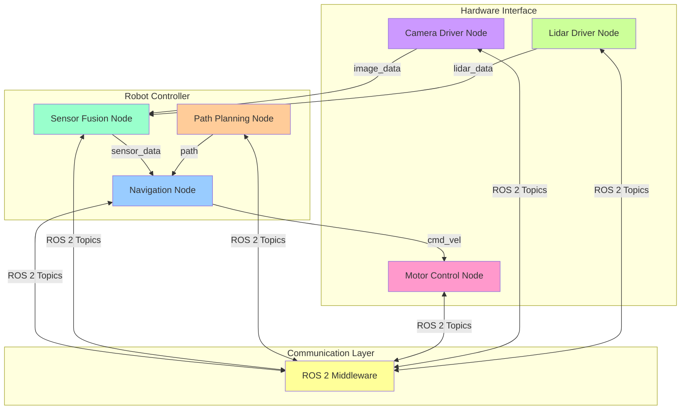

# Lesson 2: The Robotic Nervous System (ROS 2)

## Conceptual Overview

ROS 2 (Robot Operating System 2) serves as the nervous system for robotic applications, providing the communication infrastructure that enables different components to interact seamlessly. Just as the biological nervous system coordinates sensory input, processing, and motor output, ROS 2 coordinates data flow between perception, decision-making, and action modules in robotic systems.

ROS 2 is not an operating system in the traditional sense, but rather a middleware framework that provides services such as hardware abstraction, device drivers, libraries, visualizers, message-passing, package management, and more. It enables the distributed nature of robotic systems by allowing components to run on different machines while maintaining transparent communication.

### Core Concepts

**Nodes**: Independent processes that perform computation. Each node typically handles a specific function (e.g., sensor processing, motion planning, control).

**Topics**: Named buses over which nodes exchange messages. Topics implement a publish-subscribe communication pattern.

**Services**: Synchronous request-response communication between nodes, similar to client-server architecture.

**Actions**: Asynchronous, goal-oriented communication for long-running tasks with feedback.

## Architecture Diagram



This diagram illustrates the distributed nature of ROS 2, where different nodes handle specialized functions and communicate through the middleware.

## Toolchain Overview

Working with ROS 2 requires a specific toolchain:

- **ROS 2 Distribution**: Currently Humble Hawksbill or Iron Irwini
- **Python 3.8+ or C++17**: Primary development languages
- **DDS Implementation**: RMW (ROS Middleware) layer (Fast DDS, Cyclone DDS, etc.)
- **Build Tools**: colcon for building packages
- **Development Environment**: Typically Ubuntu 22.04 LTS

## Hands-on Lab: Building a ROS 2 Node

In this lab, you'll create a simple ROS 2 node that simulates a humanoid robot's decision-making process.

### Prerequisites

- ROS 2 Humble Hawksbill installed
- Python 3.8+
- Basic understanding of Python

### Lab Exercise

1. **Create a ROS 2 workspace:**

```bash
# Create workspace directory
mkdir -p ~/ros2_ws/src
cd ~/ros2_ws

# Source ROS 2 environment
source /opt/ros/humble/setup.bash
```

2. **Create a new ROS 2 package:**

```bash
# Create a new package for our humanoid robot node
cd ~/ros2_ws/src
ros2 pkg create --build-type ament_python humanoid_decision_maker --dependencies rclpy std_msgs sensor_msgs geometry_msgs
```

3. **Create the main ROS 2 node:**

Create the file `~/ros2_ws/src/humanoid_decision_maker/humanoid_decision_maker/humanoid_controller.py`:

```python
#!/usr/bin/env python3
"""
Humanoid Robot Decision Maker Node
Implements the 'nervous system' for a humanoid robot
"""

import rclpy
from rclpy.node import Node
from std_msgs.msg import String, Float32
from sensor_msgs.msg import LaserScan
from geometry_msgs.msg import Twist
import random


class HumanoidController(Node):
    def __init__(self):
        super().__init__('humanoid_controller')

        # Create subscribers
        self.sensor_subscription = self.create_subscription(
            LaserScan,
            'scan',
            self.sensor_callback,
            10)

        self.voice_subscription = self.create_subscription(
            String,
            'voice_commands',
            self.voice_callback,
            10)

        # Create publisher for movement commands
        self.cmd_vel_publisher = self.create_publisher(
            Twist,
            'cmd_vel',
            10)

        # Timer for decision loop
        self.timer = self.create_timer(0.1, self.decision_loop)

        # Robot state
        self.obstacle_distance = float('inf')
        self.voice_command = None
        self.last_command_time = self.get_clock().now()

        self.get_logger().info('Humanoid Controller Node Started')

    def sensor_callback(self, msg):
        """Process sensor data from laser scanner"""
        if len(msg.ranges) > 0:
            # Get minimum distance from front-facing sensors
            front_ranges = msg.ranges[:30] + msg.ranges[-30:]  # Front 60 degrees
            self.obstacle_distance = min([r for r in front_ranges if r > 0.1], default=float('inf'))
        self.get_logger().debug(f'Obstacle distance: {self.obstacle_distance:.2f}m')

    def voice_callback(self, msg):
        """Process voice commands"""
        self.voice_command = msg.data
        self.last_command_time = self.get_clock().now()
        self.get_logger().info(f'Received voice command: {msg.data}')

    def decision_loop(self):
        """Main decision-making loop"""
        cmd_vel = Twist()

        # Default behavior: wander if no obstacles
        if self.obstacle_distance > 1.0:  # No obstacles nearby
            cmd_vel.linear.x = 0.2  # Move forward
            cmd_vel.angular.z = 0.0
        else:  # Obstacle detected
            cmd_vel.linear.x = 0.0
            cmd_vel.angular.z = 0.5  # Turn right to avoid obstacle

        # Override with voice command if recent
        if self.voice_command:
            time_since_command = self.get_clock().now() - self.last_command_time
            if time_since_command.nanoseconds < 5e9:  # 5 seconds
                if 'stop' in self.voice_command.lower():
                    cmd_vel.linear.x = 0.0
                    cmd_vel.angular.z = 0.0
                elif 'forward' in self.voice_command.lower():
                    cmd_vel.linear.x = 0.3
                    cmd_vel.angular.z = 0.0
                elif 'turn left' in self.voice_command.lower():
                    cmd_vel.linear.x = 0.0
                    cmd_vel.angular.z = 0.5
                elif 'turn right' in self.voice_command.lower():
                    cmd_vel.linear.x = 0.0
                    cmd_vel.angular.z = -0.5

        # Publish command
        self.cmd_vel_publisher.publish(cmd_vel)


def main(args=None):
    rclpy.init(args=args)
    humanoid_controller = HumanoidController()

    try:
        rclpy.spin(humanoid_controller)
    except KeyboardInterrupt:
        pass
    finally:
        humanoid_controller.destroy_node()
        rclpy.shutdown()


if __name__ == '__main__':
    main()
```

4. **Create the launch file:**

Create `~/ros2_ws/src/humanoid_decision_maker/launch/humanoid_demo.launch.py`:

```python
from launch import LaunchDescription
from launch_ros.actions import Node


def generate_launch_description():
    return LaunchDescription([
        Node(
            package='humanoid_decision_maker',
            executable='humanoid_controller',
            name='humanoid_controller',
            output='screen'
        )
    ])
```

5. **Update the setup.py file:**

Edit `~/ros2_ws/src/humanoid_decision_maker/setup.py`:

```python
from setuptools import setup
import os
from glob import glob

package_name = 'humanoid_decision_maker'

setup(
    name=package_name,
    version='0.0.0',
    packages=[package_name],
    data_files=[
        ('share/ament_index/resource_index/packages',
            ['resource/' + package_name]),
        ('share/' + package_name, ['package.xml']),
        (os.path.join('share', package_name, 'launch'), glob('launch/*.launch.py')),
    ],
    install_requires=['setuptools'],
    zip_safe=True,
    maintainer='Your Name',
    maintainer_email='your.email@example.com',
    description='Humanoid Robot Decision Maker Node',
    license='Apache License 2.0',
    tests_require=['pytest'],
    entry_points={
        'console_scripts': [
            'humanoid_controller = humanoid_decision_maker.humanoid_controller:main',
        ],
    },
)
```

6. **Build and run the package:**

```bash
# Build the package
cd ~/ros2_ws
source /opt/ros/humble/setup.bash
colcon build --packages-select humanoid_decision_maker

# Source the workspace
source install/setup.bash

# Run the node
ros2 run humanoid_decision_maker humanoid_controller
```

## Expected Simulation Results

When you run the ROS 2 node:

- The node will start and display "Humanoid Controller Node Started"
- It will process simulated sensor data and make navigation decisions
- The robot will move forward until it detects obstacles
- Voice commands will override default behavior
- Movement commands will be published to the `/cmd_vel` topic

This demonstrates the ROS 2 communication model where nodes publish and subscribe to topics to coordinate robot behavior.

## Common Errors & Debugging

### Error: Node Not Found
**Symptom**: `ros2 run` command fails with "executable not found"
**Solution**: Ensure the package is built and sourced properly with `source install/setup.bash`

### Error: Topic Connection Issues
**Symptom**: Nodes can't communicate with each other
**Solution**: Check that all nodes are on the same ROS domain and namespace

### Error: Permission Issues
**Symptom**: Can't create publishers/subscribers
**Solution**: Ensure proper DDS configuration and check network settings

## Industry Notes

ROS 2 has become the de facto standard for robotic development in industry:

- **Autonomous Vehicles**: Perception, planning, and control systems
- **Manufacturing**: Assembly and quality control robots
- **Healthcare**: Surgical and assistive robots
- **Research**: Academic and commercial robotics research

ROS 2's Quality of Service (QoS) settings allow fine-tuning for different applications, from best-effort communication to reliable delivery with deadlines.

## Mini Challenge

Enhance the humanoid controller to include emotional responses. When the robot encounters certain situations (like being too close to obstacles or receiving specific voice commands), it should publish emotional states to a new topic `/emotions`. Implement at least 3 different emotional states and the conditions that trigger them.

**Challenge Criteria:**
- New emotion publisher in the controller node
- At least 3 distinct emotional states
- Conditions that trigger emotional responses
- Clear mapping between situations and emotions

## Summary

In this lesson, you've learned about ROS 2 as the nervous system for robotic applications. Key takeaways include:

- Nodes provide modularity for different robot functions
- Topics enable publish-subscribe communication
- Services support request-response patterns
- Actions handle long-running, goal-oriented tasks
- The distributed architecture enables complex robotic systems

ROS 2 provides the essential communication infrastructure for building sophisticated humanoid robots, enabling the coordination of perception, decision-making, and action modules.