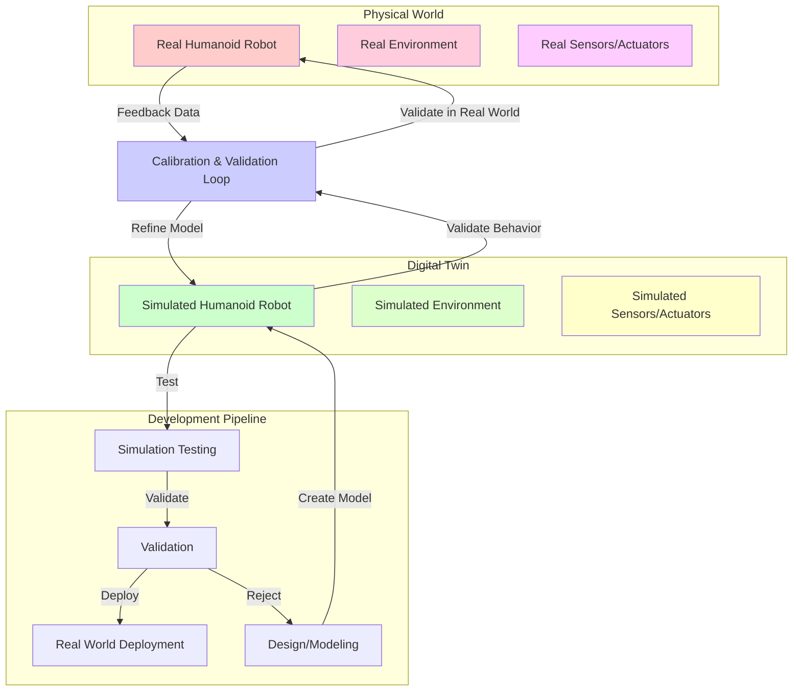

# Lesson 3: Digital Twins: Simulating Reality

## Conceptual Overview

Digital twins represent virtual replicas of physical systems that enable safe testing, validation, and optimization of robotic behaviors before deployment in the real world. In the context of Physical AI and humanoid robotics, digital twins serve as controlled environments where complex behaviors can be developed and refined without risk to hardware or humans.

A digital twin in robotics encompasses not just the physical appearance of a robot, but also its kinematics, dynamics, sensors, and environmental interactions. It simulates the physics of the real world including gravity, collisions, friction, and material properties, allowing for realistic testing of robot behaviors.

The simulation-first approach is fundamental to Physical AI development, enabling rapid iteration and validation of complex behaviors that would be expensive or dangerous to test on physical hardware directly.

## Architecture Diagram



This diagram illustrates the relationship between physical robots, their digital twins, and the development pipeline that uses simulation for safe testing.

## Toolchain Overview

Digital twin development for robotics requires specialized tools:

- **Gazebo**: Physics-based simulation environment with realistic rendering
- **Unity Robotics**: Game-engine-based simulation with advanced visualization
- **Webots**: General-purpose robot simulation software
- **NVIDIA Isaac Sim**: High-fidelity simulation for AI development
- **ROS 2 Integration**: Bridging simulation and real-world communication
- **Physics Engines**: ODE, Bullet, or NVIDIA PhysX for realistic physics

## Hands-on Lab: Creating a Digital Twin Environment

In this lab, you'll set up a basic digital twin simulation using Gazebo and ROS 2 to test a simple robot behavior.

### Prerequisites

- ROS 2 Humble Hawksbill
- Gazebo Garden or Fortress
- Basic understanding of URDF (Unified Robot Description Format)

### Lab Exercise

1. **Create a simple robot URDF:**

Create the file `~/simulation_ws/src/my_robot_description/urdf/simple_humanoid.urdf`:

```xml
<?xml version="1.0"?>
<robot name="simple_humanoid">
  <!-- Base Link -->
  <link name="base_link">
    <visual>
      <geometry>
        <box size="0.5 0.3 0.6"/>
      </geometry>
      <material name="blue">
        <color rgba="0 0 1 0.8"/>
      </material>
    </visual>
    <collision>
      <geometry>
        <box size="0.5 0.3 0.6"/>
      </geometry>
    </collision>
    <inertial>
      <mass value="10.0"/>
      <inertia ixx="1.0" ixy="0.0" ixz="0.0" iyy="1.0" iyz="0.0" izz="1.0"/>
    </inertial>
  </link>

  <!-- Head -->
  <joint name="head_joint" type="fixed">
    <parent link="base_link"/>
    <child link="head"/>
    <origin xyz="0 0 0.4" rpy="0 0 0"/>
  </joint>

  <link name="head">
    <visual>
      <geometry>
        <sphere radius="0.15"/>
      </geometry>
      <material name="white">
        <color rgba="1 1 1 0.8"/>
      </material>
    </visual>
    <collision>
      <geometry>
        <sphere radius="0.15"/>
      </geometry>
    </collision>
    <inertial>
      <mass value="2.0"/>
      <inertia ixx="0.02" ixy="0.0" ixz="0.0" iyy="0.02" iyz="0.0" izz="0.02"/>
    </inertial>
  </link>

  <!-- Left Arm -->
  <joint name="left_arm_joint" type="continuous">
    <parent link="base_link"/>
    <child link="left_arm"/>
    <origin xyz="0.25 0 0.1" rpy="0 0 0"/>
    <axis xyz="0 1 0"/>
  </joint>

  <link name="left_arm">
    <visual>
      <geometry>
        <cylinder length="0.4" radius="0.05"/>
      </geometry>
      <material name="gray">
        <color rgba="0.5 0.5 0.5 0.8"/>
      </material>
    </visual>
    <collision>
      <geometry>
        <cylinder length="0.4" radius="0.05"/>
      </geometry>
    </collision>
    <inertial>
      <mass value="1.0"/>
      <inertia ixx="0.01" ixy="0.0" ixz="0.0" iyy="0.01" iyz="0.0" izz="0.005"/>
    </inertial>
  </link>

  <!-- Right Arm -->
  <joint name="right_arm_joint" type="continuous">
    <parent link="base_link"/>
    <child link="right_arm"/>
    <origin xyz="-0.25 0 0.1" rpy="0 0 0"/>
    <axis xyz="0 1 0"/>
  </joint>

  <link name="right_arm">
    <visual>
      <geometry>
        <cylinder length="0.4" radius="0.05"/>
      </geometry>
      <material name="gray">
        <color rgba="0.5 0.5 0.5 0.8"/>
      </material>
    </visual>
    <collision>
      <geometry>
        <cylinder length="0.4" radius="0.05"/>
      </geometry>
    </collision>
    <inertial>
      <mass value="1.0"/>
      <inertia ixx="0.01" ixy="0.0" ixz="0.0" iyy="0.01" iyz="0.0" izz="0.005"/>
    </inertial>
  </link>

  <!-- Sensors -->
  <gazebo reference="base_link">
    <material>Gazebo/Blue</material>
  </gazebo>

  <gazebo reference="head">
    <material>Gazebo/White</material>
  </gazebo>

  <gazebo reference="left_arm">
    <material>Gazebo/Grey</material>
  </gazebo>

  <gazebo reference="right_arm">
    <material>Gazebo/Grey</material>
  </gazebo>
</robot>
```

2. **Create a Gazebo world file:**

Create `~/simulation_ws/src/my_robot_description/worlds/simple_world.world`:

```xml
<?xml version="1.0" ?>
<sdf version="1.7">
  <world name="simple_world">
    <!-- Include a model of the sun -->
    <include>
      <uri>model://sun</uri>
    </include>

    <!-- Set the physics engine -->
    <physics name="1ms" type="ode">
      <max_step_size>0.001</max_step_size>
      <real_time_factor>1</real_time_factor>
      <real_time_update_rate>1000</real_time_update_rate>
    </physics>

    <!-- Ground plane -->
    <include>
      <uri>model://ground_plane</uri>
    </include>

    <!-- Create a simple room -->
    <model name="room">
      <pose>0 0 2.5 0 0 0</pose>
      <static>true</static>
      <link name="floor">
        <visual name="floor_visual">
          <geometry>
            <box>
              <size>10 10 0.1</size>
            </box>
          </geometry>
          <material>
            <ambient>0.3 0.3 0.3 1</ambient>
            <diffuse>0.8 0.8 0.8 1</diffuse>
          </material>
        </visual>
        <collision name="floor_collision">
          <geometry>
            <box>
              <size>10 10 0.1</size>
            </box>
          </geometry>
        </collision>
        <inertial>
          <mass>1e10</mass>
          <inertia>
            <ixx>1e10</ixx>
            <ixy>0</ixy>
            <ixz>0</ixz>
            <iyy>1e10</iyy>
            <iyz>0</iyz>
            <izz>1e10</izz>
          </inertia>
        </inertial>
      </link>

      <!-- Walls -->
      <link name="wall_1">
        <pose>5 0 2.5 0 0 0</pose>
        <visual name="wall_1_visual">
          <geometry>
            <box>
              <size>0.1 10 5</size>
            </box>
          </geometry>
          <material>
            <ambient>0.4 0.4 0.4 1</ambient>
            <diffuse>0.7 0.7 0.7 1</diffuse>
          </material>
        </visual>
        <collision name="wall_1_collision">
          <geometry>
            <box>
              <size>0.1 10 5</size>
            </box>
          </geometry>
        </collision>
        <inertial>
          <mass>1e10</mass>
          <inertia>
            <ixx>1e10</ixx>
            <ixy>0</ixy>
            <ixz>0</ixz>
            <iyy>1e10</iyy>
            <iyz>0</iyz>
            <izz>1e10</izz>
          </inertia>
        </inertial>
      </link>

      <link name="wall_2">
        <pose>-5 0 2.5 0 0 0</pose>
        <visual name="wall_2_visual">
          <geometry>
            <box>
              <size>0.1 10 5</size>
            </box>
          </geometry>
          <material>
            <ambient>0.4 0.4 0.4 1</ambient>
            <diffuse>0.7 0.7 0.7 1</diffuse>
          </material>
        </visual>
        <collision name="wall_2_collision">
          <geometry>
            <box>
              <size>0.1 10 5</size>
            </box>
          </geometry>
        </collision>
        <inertial>
          <mass>1e10</mass>
          <inertia>
            <ixx>1e10</ixx>
            <ixy>0</ixy>
            <ixz>0</ixz>
            <iyy>1e10</iyy>
            <iyz>0</iyz>
            <izz>1e10</izz>
          </inertia>
        </inertial>
      </link>
    </model>

    <!-- Add a few obstacles for the robot to navigate around -->
    <model name="obstacle_1">
      <pose>-2 2 0.5 0 0 0</pose>
      <link name="obstacle_1_link">
        <visual name="obstacle_1_visual">
          <geometry>
            <box>
              <size>0.5 0.5 1.0</size>
            </box>
          </geometry>
          <material>
            <ambient>1 0 0 1</ambient>
            <diffuse>1 0.5 0.5 1</diffuse>
          </material>
        </visual>
        <collision name="obstacle_1_collision">
          <geometry>
            <box>
              <size>0.5 0.5 1.0</size>
            </box>
          </geometry>
        </collision>
        <inertial>
          <mass>1.0</mass>
          <inertia>
            <ixx>0.1</ixx>
            <ixy>0</ixy>
            <ixz>0</ixz>
            <iyy>0.1</iyy>
            <iyz>0</iyz>
            <izz>0.1</izz>
          </inertia>
        </inertial>
      </link>
    </model>

    <model name="obstacle_2">
      <pose>2 -2 0.5 0 0 0</pose>
      <link name="obstacle_2_link">
        <visual name="obstacle_2_visual">
          <geometry>
            <cylinder>
              <radius>0.3</radius>
              <length>1.0</length>
            </cylinder>
          </geometry>
          <material>
            <ambient>0 1 0 1</ambient>
            <diffuse>0.5 1 0.5 1</diffuse>
          </material>
        </visual>
        <collision name="obstacle_2_collision">
          <geometry>
            <cylinder>
              <radius>0.3</radius>
              <length>1.0</length>
            </cylinder>
          </geometry>
        </collision>
        <inertial>
          <mass>1.0</mass>
          <inertia>
            <ixx>0.1</ixx>
            <ixy>0</ixy>
            <ixz>0</ixz>
            <iyy>0.1</iyy>
            <iyz>0</iyz>
            <izz>0.1</izz>
          </inertia>
        </inertial>
      </link>
    </model>
  </world>
</sdf>
```

3. **Create a launch file to spawn the robot in simulation:**

Create `~/simulation_ws/src/my_robot_description/launch/spawn_robot.launch.py`:

```python
from launch import LaunchDescription
from launch.actions import DeclareLaunchArgument, IncludeLaunchDescription
from launch.launch_description_sources import PythonLaunchDescriptionSource
from launch.substitutions import LaunchConfiguration, PathJoinSubstitution
from launch_ros.actions import Node
from launch_ros.substitutions import FindPackageShare
from ament_index_python.packages import get_package_share_directory
import os

def generate_launch_description():
    # Launch arguments
    use_sim_time = LaunchConfiguration('use_sim_time', default='true')
    world_file = LaunchConfiguration('world', default=os.path.join(
        get_package_share_directory('my_robot_description'),
        'worlds', 'simple_world.world'
    ))

    # Launch Gazebo
    gazebo = IncludeLaunchDescription(
        PythonLaunchDescriptionSource([
            get_package_share_directory('gazebo_ros'),
            '/launch',
            '/gazebo.launch.py'
        ]),
        launch_arguments={
            'world': world_file,
        }.items()
    )

    # Spawn robot in Gazebo
    spawn_entity = Node(
        package='gazebo_ros',
        executable='spawn_entity.py',
        arguments=[
            '-topic', 'robot_description',
            '-entity', 'simple_humanoid',
            '-x', '0', '-y', '0', '-z', '0.5'  # Start above ground
        ],
        output='screen'
    )

    # Robot State Publisher
    robot_state_publisher = Node(
        package='robot_state_publisher',
        executable='robot_state_publisher',
        name='robot_state_publisher',
        output='screen',
        parameters=[{'use_sim_time': use_sim_time}]
    )

    # Joint State Publisher
    joint_state_publisher = Node(
        package='joint_state_publisher',
        executable='joint_state_publisher',
        name='joint_state_publisher',
        output='screen',
        parameters=[{'use_sim_time': use_sim_time}]
    )

    return LaunchDescription([
        DeclareLaunchArgument(
            'use_sim_time',
            default_value='true',
            description='Use simulation (Gazebo) clock if true'
        ),
        DeclareLaunchArgument(
            'world',
            default_value=os.path.join(
                get_package_share_directory('my_robot_description'),
                'worlds', 'simple_world.world'
            ),
            description='Choose one of the world files from `/my_robot_description/worlds`'
        ),
        gazebo,
        robot_state_publisher,
        joint_state_publisher,
        spawn_entity,
    ])
```

4. **Create a simple controller to test the digital twin:**

Create `~/simulation_ws/src/my_robot_description/my_robot_description/arm_controller.py`:

```python
#!/usr/bin/env python3
"""
Simple controller to test arm movement in the digital twin
"""

import rclpy
from rclpy.node import Node
from std_msgs.msg import Float64MultiArray
from sensor_msgs.msg import JointState
import time


class ArmController(Node):
    def __init__(self):
        super().__init__('arm_controller')

        # Create publishers for joint commands
        self.joint_publisher = self.create_publisher(
            Float64MultiArray,
            '/joint_commands',
            10
        )

        # Create subscriber for joint states
        self.joint_subscriber = self.create_subscription(
            JointState,
            '/joint_states',
            self.joint_state_callback,
            10
        )

        # Timer for periodic commands
        self.timer = self.create_timer(0.5, self.send_arm_command)

        # Joint position tracking
        self.joint_positions = {}

        self.get_logger().info('Arm Controller Node Started')

        # Initialize positions
        self.arm_positions = [0.0, 0.0]  # left_arm, right_arm
        self.position_index = 0

    def joint_state_callback(self, msg):
        """Update joint positions from sensor data"""
        for i, name in enumerate(msg.name):
            if name in ['left_arm_joint', 'right_arm_joint']:
                self.joint_positions[name] = msg.position[i]

    def send_arm_command(self):
        """Send periodic commands to move arms"""
        # Create joint command message
        cmd_msg = Float64MultiArray()

        # Alternate between different arm positions
        if self.position_index == 0:
            self.arm_positions = [0.5, -0.5]  # Left up, right down
        else:
            self.arm_positions = [-0.3, 0.3]  # Left down, right up

        self.position_index = 1 - self.position_index  # Toggle index

        cmd_msg.data = self.arm_positions

        # Publish the command
        self.joint_publisher.publish(cmd_msg)

        self.get_logger().info(f'Commanded arm positions: {self.arm_positions}')
        self.get_logger().info(f'Current joint positions: {self.joint_positions}')


def main(args=None):
    rclpy.init(args=args)
    arm_controller = ArmController()

    try:
        rclpy.spin(arm_controller)
    except KeyboardInterrupt:
        pass
    finally:
        arm_controller.destroy_node()
        rclpy.shutdown()


if __name__ == '__main__':
    main()
```

5. **Set up the simulation environment:**

First, make sure Gazebo is installed and source your ROS 2 environment:

```bash
# Source ROS 2
source /opt/ros/humble/setup.bash

# Create simulation workspace
mkdir -p ~/simulation_ws/src
cd ~/simulation_ws

# Create package directory
mkdir -p src/my_robot_description/{urdf,worlds,launch}
mkdir -p src/my_robot_description/my_robot_description

# Copy the files you created above to the appropriate locations
# Then build the workspace:
colcon build --packages-select my_robot_description

# Source the workspace
source install/setup.bash

# Launch the simulation
ros2 launch my_robot_description spawn_robot.launch.py
```

## Expected Simulation Results

When you run the digital twin simulation:

- The simple humanoid robot model will appear in the Gazebo environment
- The robot will be placed in a room with obstacles to navigate around
- You should be able to observe the robot's visual representation in the Gazebo GUI
- The robot's joints will be accessible for control through ROS 2 topics
- Physics will be simulated, including gravity, collisions, and realistic movement

This demonstrates the core concept of digital twins where the virtual robot behaves according to the same physical laws as a real robot would.

## Common Errors & Debugging

### Error: Robot Falls Through Floor
**Symptom**: Robot falls through the ground plane
**Solution**: Check inertia parameters and collision geometry in the URDF

### Error: Gazebo Doesn't Start
**Symptom**: Gazebo fails to launch or crashes immediately
**Solution**: Check graphics drivers and ensure GPU acceleration is available

### Error: Robot Model Not Visible
**Symptom**: Robot spawns but isn't visible in Gazebo
**Solution**: Check visual geometry and material definitions in URDF

## Industry Notes

Digital twins are essential in modern robotics development:

- **Automotive**: Testing autonomous vehicles in virtual environments before real-world deployment
- **Manufacturing**: Validating robotic assembly processes in simulation
- **Healthcare**: Training surgical robots without risk to patients
- **Space Exploration**: Testing rover operations in simulated environments

Major companies like NVIDIA (Isaac Sim), Unity, and AWS (RoboMaker) provide specialized platforms for digital twin development.

## Mini Challenge

Enhance the digital twin by adding a simple sensor to the robot (e.g., a laser scanner or camera) and modify the controller to use sensor feedback for navigation. The robot should be able to detect obstacles in the simulation and navigate around them autonomously.

**Challenge Criteria:**
- Add a simulated sensor to the URDF model
- Implement sensor data processing in the controller
- Create obstacle avoidance behavior based on sensor input
- Demonstrate successful navigation in simulation

## Summary

In this lesson, you've explored digital twins as essential tools for Physical AI development. Key takeaways include:

- Digital twins enable safe, cost-effective testing of robotic behaviors
- Physics simulation must accurately model real-world properties
- The simulation-first approach is critical for complex robot development
- Gazebo provides a robust platform for robotics simulation
- ROS 2 bridges the gap between simulation and real-world deployment

Digital twins represent the foundation of safe and efficient Physical AI development, allowing for rapid iteration and validation before hardware deployment.